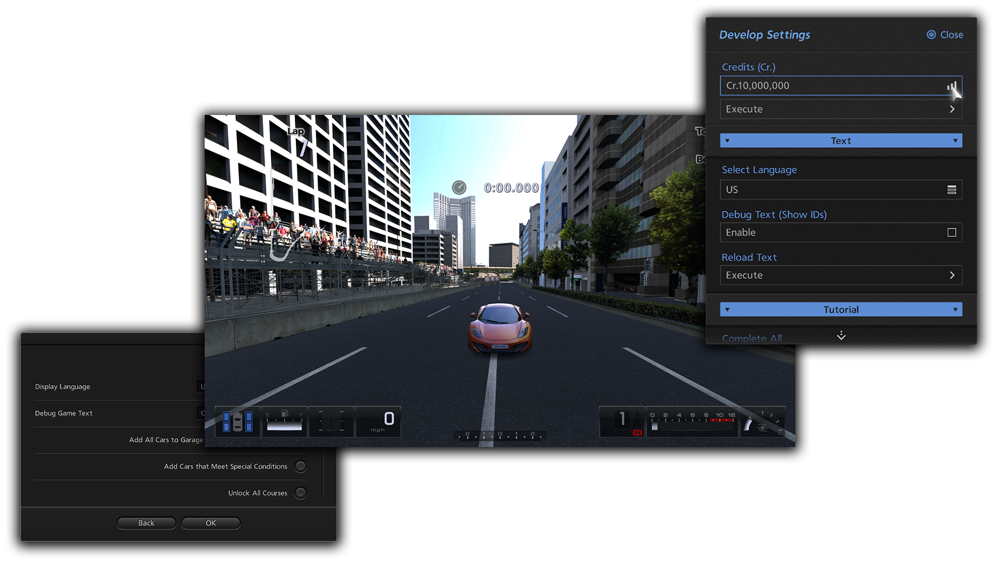

<h4 align="center">A small collection of Gran Turismo 5 (BCUS98114) and Gran Turismo 6 (NPUA81049) patches built for RPCS3.</h4>

If you don't wanna manually add each patch into one file or cherry-pick, you can download [this]() patch which has everything listed below.

 ⠀
# Gran Turismo 6 v1.05
- [Enable QA/Debug Mode](https://github.com/oo-ka-mi/gt/blob/main/patches/qa/qav105.yml)

⠀
# Gran Turismo 5 v2.11
- [Custom FOV (illusion)](https://github.com/oo-ka-mi/gt/blob/main/patches/camera/fovv211.yml)

⠀
# Gran Turismo 5 v1.10
- [Enable QA/Debug Mode](https://github.com/oo-ka-mi/gt/blob/main/patches/qa/qav110.yml)
- [Custom FOV (illusion)](https://github.com/oo-ka-mi/gt/blob/main/patches/camera/fovv110.yml)

⠀
# Gran Turismo 5 v1.00
- [Enable QA/Debug Mode](https://github.com/oo-ka-mi/gt/blob/main/patches/qa/qav100.yml)
